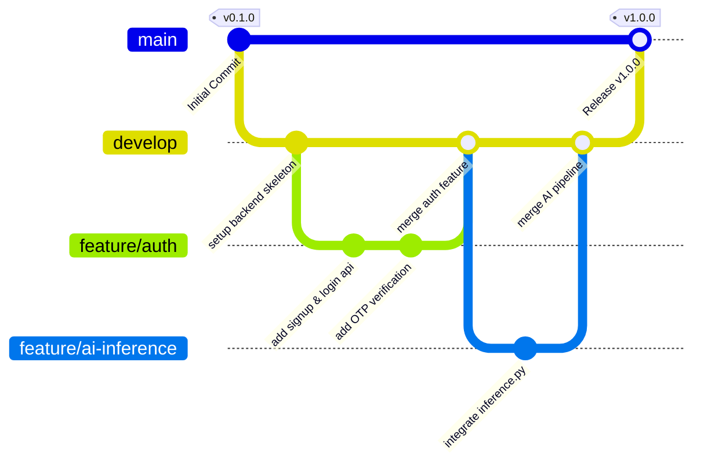

# HemoScan AI — Version Control and Containerization Report

---
## PAGE 1 — COVER PAGE
---

# PROJECT TITLE: HEMOSCAN AI
## Clinical Decision Support System for Brain Hemorrhage Detection and Classification

### COURSE INFORMATION
* **Course Name:** CSA1015 – Software Engineering
* **Assessment Task:** AT1 – Version Control and Containerization Report

### STUDENT DETAILS
* **Student Name:** [Your Name]
* **Student ID:** [Your Student ID]
* **Email Address:** [Your Student Email]

### FACULTY DETAILS
* **Department:** Faculty of Computing and Information Technology
* **Instructor Name:** [Instructor Name]

### PROJECT ACCESS
* **GitHub Repository:** `https://github.com/[YourGitHubUsername]/hemoscan-capstone`
* **Development Branch:** `develop`
* **Production Branch:** `main`

---
## PAGE 2 — PROBLEM ANALYSIS
---

### 1. Introduction and Problem Statement
In emergency medicine, acute neurological trauma or vascular accidents—specifically intracranial hemorrhages (brain bleeding)—require rapid diagnostic triage. Misdiagnosis or delayed localization of a hemorrhage leads to high mortality rates and permanent neurological deficits. Radiologists and clinical staff rely on Computed Tomography (CT) scans to make life-critical decisions. 

However, manual interpretation of brain CT images is:
1. **Time-Consuming:** High volume of scans causes queues in emergency departments.
2. **Subject to Cognitive Fatigue:** Subtle bleeding regions (such as tiny subdural or subarachnoid hematomas) can be overlooked.
3. **Variable in Diagnostic Accuracy:** Interpretation depends on the practitioner’s specialization level.

**HemoScan AI** resolves this problem by implementing a clinical decision support platform consisting of a React-based web dashboard and a REST API backend integrated with a 3-stage TensorFlow Lite (TFLite) machine learning inference engine. It automatically validates if an upload is a brain CT scan (Gatekeeper), detects hemorrhage regions (YOLO Detector), and classifies the hemorrhage into five clinical subtypes: *Intraventricular, Intraparenchymal, Subarachnoid, Epidural,* and *Subdural*.

### 2. Project Objectives
* **Rapid Triage:** Deliver scan classification results and bounding box overlays under 5 seconds.
* **Clinical Safety & Interoperability:** Provide clean separation of concerns between patient record storage, diagnostic history, and model execution.
* **Environmental Consistency:** Guarantee that the complex Python AI execution environment, PHP database connectivity, and React Vite frontend build remain identical across local development environments, staging systems, and production environments.

### 3. Functional Requirements Addressed
* **Doctor Authentication & Security:** Signup, secure login, and verification code (OTP) workflows using PHPMailer.
* **Patient Record & Scan Storage:** Structured storage of patient IDs, ages, genders, and associated diagnostics linked with the active physician's email.
* **Multistage AI Diagnostics:** Automated inference to identify whether a brain CT scan exhibits a hemorrhage, draw the boundary, and assign subtype confidence percentages.
* **Push Notification Sync:** Immediate alerts (via Firebase Cloud Messaging) for abnormal scan detections.

### 4. Need for Software Engineering Tools
Developing a multi-tier clinical dashboard (Vite React TypeScript client, PHP Apache backend, Python TFLite engine, MySQL database) introduces environment dependency issues ("works on my machine" syndrome). The PHP server requires specific extensions (`mysqli`, `gd`, `pdo_mysql`), and the AI script requires system-level libraries (`ai-edge-litert` or `tflite-runtime`, `numpy`, `Pillow`) and Python interpreter configuration.
* **Git** ensures safe collaborative tracking, auditability of code changes, and branching safeguards for features.
* **Docker** containerizes the application, packaging the environment configuration directly with the source code, eliminating version conflicts and enabling rapid local environment setup with a single command.

---
## PAGE 3 — PROJECT STRUCTURE DESIGN
---

### Codebase Directory Layout
Below is the directory tree of the HemoScan AI repository showing the separation of front-end assets, PHP backend endpoints, database migration scripts, and machine learning models:

```text
Capstone Project/
├── E:/Capstone Project/ (Workspace Root)
│   ├── docker-compose.yml              # Multi-container service configuration
│   ├── Backend/                        # REST API + AI Inference Engine
│   │   ├── Dockerfile                  # PHP 8.2-Apache + Python 3 container config
│   │   ├── .gitignore                  # Git exclusions for backend config & cache
│   │   ├── db.php                      # MySQL connection client with CORS headers
│   │   ├── config.php                  # Global config variables (credentials, SMTP, FCM)
│   │   ├── config.example.php          # Template for credential distribution
│   │   ├── signup.php                  # User signup logic
│   │   ├── login.php                   # User login logic
│   │   ├── send_otp.php                # OTP transmission via SMTP
│   │   ├── verify_otp.php              # OTP verification logic
│   │   ├── upload_scan.php             # Image upload handler & API database sync
│   │   ├── analyze.php                 # PHP bridge that invokes inference.py
│   │   ├── inference.py                # 3-Stage Python TFLite AI execution engine
│   │   ├── get_scans.php               # Patient scanning history sync (delta support)
│   │   ├── get_dashboard.php           # Statistics aggregation endpoint
│   │   ├── submit_ticket.php           # Support ticket submission script
│   │   ├── setup_db.sql                # Core database schema (doctors, scans, OTP)
│   │   ├── add_notifications_table.sql # Notifications schema migration
│   │   ├── create_tickets_table.sql    # Support ticket schema migration
│   │   ├── uploads/                    # Local storage (Git ignored, volume mounted)
│   │   │   ├── scans/                  # Saved CT scans and bounding-box drawings
│   │   │   └── profiles/               # Doctor profile pictures
│   │   └── models/                     # ML Model Files (Git ignored)
│   │       ├── brain_ct_classifier.tflite
│   │       ├── hemorrhage_detector.tflite
│   │       └── Hemorrhage.tflite
│   │
│   └── HemoScan Web/                   # Vite + React + TS Frontend Dashboard
│       ├── Dockerfile                  # Multi-stage production Nginx container
│       ├── .dockerignore               # Local cache exclusion list for build context
│       ├── .gitignore                  # Git exclusions for node_modules and builds
│       ├── index.html                  # HTML entry point template
│       ├── package.json                # Project dependencies and script declarations
│       ├── vite.config.ts              # Bundler and dev-server configuration
│       ├── src/                        # React Application Source
│       │   ├── main.tsx                # Mounts App component to HTML DOM
│       │   ├── App.tsx                 # Core layout, state-driven router, and panels
│       │   ├── App.css                 # Main styling classes
│       │   ├── index.css               # Styling rules and typography
│       │   ├── services/
│       │   │   ├── api.ts              # REST API Fetch wrapper & query cache layer
│       │   │   └── classifier.ts       # Frontend-to-backend AI client and Canvas Drawer
│       │   └── hooks/
│       │       └── useFCM.ts           # Firebase Push Notification browser hooks
```

---
## PAGE 4 — FILE/FOLDER EXPLANATION & GIT INITIALIZATION
---

### 1. Folder Architecture Explanations
| Component / File | Purpose and Relevance in the Application |
| :--- | :--- |
| `docker-compose.yml` | Standardizes environment orchestration. Defines `db`, `backend`, and `frontend` network layers. |
| `Backend/` | The server-side layer. Handles state changes, image uploads, SQL queries, and AI script execution. |
| `Backend/models/` | Stores the heavy binary TFLite files. Ignored in Git to prevent repository bloat; instead, versioned separately. |
| `Backend/uploads/` | Dynamic folder for scans. Ignored in Git and volume-mounted to prevent data loss upon container rebuilds. |
| `HemoScan Web/` | Frontend single-page application. Features responsive layout, dashboard counters, and Canvas scan overlays. |
| `HemoScan Web/src/services/api.ts` | Communicates with the backend REST endpoints. Implements a client-side cache to lower query counts. |
| `HemoScan Web/src/services/classifier.ts` | Triggers the backend AI analysis. Draws red bounding boxes on the client browser canvas. |

### 2. Git Repository Initialization
To establish source code traceability and configure collaborative pipelines, run the following commands sequentially inside the project's root folder (`E:\Capstone Project`):

```bash
# Step 1: Initialize local Git repository
git init

# Step 2: Configure repository default branch name to 'main'
git branch -M main

# Step 3: Attach local repo to a centralized GitHub server repository
git remote add origin https://github.com/[YourGitHubUsername]/hemoscan-capstone.git

# Step 4: Verify that the remote reference matches the remote server
git remote -v

# Step 5: Check unstaged files and structure rules
git status

# Step 6: Stage all configurations and source code files
git add .

# Step 7: Create the initial commit with metadata tracking
git commit -m "chore: initial project layout configuration"

# Step 8: Push the initial codebase to the main branch on the remote server
git push -u origin main
```

---
## PAGE 5 — GIT FILES & BRANCHING STRATEGY
---

### 1. Verification of Crucial Git Files
To ensure credentials, database logs, heavy AI binaries, and dependencies are not committed to source control, configure the following local exclusion files:

#### `.gitignore` inside `E:\Capstone Project\Backend\.gitignore`
```text
# Exclude model bin files to save repo size
models/*.tflite

# Exclude private configurations with secrets
config.php

# Exclude dynamically uploaded medical images (HIPAA / Patient Confidentiality)
uploads/scans/*
uploads/profiles/*
uploads/**/*.jpg
uploads/**/*.png

# PHP Composer and runtime cache exclusions
vendor/
.phpunit.result.cache
*.log
```

#### `.gitignore` inside `E:\Capstone Project\HemoScan Web\.gitignore`
```text
# Dependency folders
node_modules/

# Production output build files
dist/

# Local configuration overrides
.env
.env.local
.env.production

# IDE folders
.vscode/
.idea/
*.suo
*.ntvs*
```

#### `.gitattributes` inside `E:\Capstone Project\.gitattributes`
```text
# Ensure consistent cross-platform line-endings (LF) for scripts and config
# Prevents CRLF syntax errors in Docker container files on Windows hosts
* text eol=lf
*.php text eol=lf
*.py text eol=lf
*.sh text eol=lf
Dockerfile text eol=lf
docker-compose.yml text eol=lf
```

### 2. General Git Branching Strategy
To support isolated, risk-managed collaborative programming, HemoScan AI uses the **Gitflow** branching model. In this setup, direct development commits to the `main` branch are strictly prohibited. Development takes place on the `develop` branch.



---
## PAGE 6 — GITFLOW MODEL & GIT WORKFLOW
---

### 1. Branch Roles in the Gitflow Model
* **`main`:** Contains production-ready code. Each commit represents a stable release tag (e.g., `v1.0.0`) that is deployed to user-facing environments.
* **`develop`:** The central integration branch. Developers merge features here to test stability before staging a production release.
* **`feature/*`:** Sandbox branches dedicated to individual task implementations (e.g., `feature/ai-integration`). Created from `develop` and merged back after testing.
* **`release/*`:** Pre-production preparation branches. Minor bugs found during staging are fixed here before merging into both `main` and `develop`.
* **`hotfix/*`:** Emergency branches created directly from `main` to address bugs currently impacting production services.

### 2. Standard Daily Git Workflow (Commands)
When starting a task (such as refactoring the PHP DB endpoints or updating the React counter UI), developers follow this command sequence:

```bash
# Step 1: Ensure local develop branch has the latest updates
git checkout develop
git pull origin develop

# Step 2: Create a feature branch for the specific task
git checkout -b feature/refactor-db-connections

# Step 3: Implement modification rules in PHP files (e.g., db.php, config.php)
# Step 4: Verify changes and check status of modified source files
git status

# Step 5: Stage the files to update
git add Backend/db.php

# Step 6: Commit changes using Conventional Commits naming conventions
git commit -m "refactor: externalize database configurations using getenv"

# Step 7: Push the local feature branch to the remote repository for review
git push -u origin feature/refactor-db-connections
```

---
## PAGE 7 — BRANCHING/MERGING & CONFLICT RESOLUTION
---

### 1. Collaborative Code Merging Workflow
Once local development of a feature is complete, it is integrated into `develop` using a Pull Request (PR) on GitHub. If another developer modified the same lines, a merge conflict occurs. Below is the command-line sequence to resolve a merge conflict:

```bash
# Step 1: Switch to develop and fetch the latest remote changes
git checkout develop
git pull origin develop

# Step 2: Switch to the feature branch
git checkout feature/refactor-db-connections

# Step 3: Rebase or merge develop into the feature branch to pull conflicts local
git merge develop

# Step 4: Resolve conflicts (conflict markers indicate conflicting changes)
# Open affected files (e.g., config.php) in VS Code. Locate conflict markers:
# <<<<<<< HEAD
# define('DB_HOST', 'localhost');
# =======
# $host = getenv('DB_HOST') ?: "127.0.0.1";
# >>>>>>> develop
# Retain the environment variable lookup syntax and delete markers.

# Step 5: Stage resolved files
git add Backend/config.php

# Step 6: Finalize the merge process
git commit -m "merge: resolve merge conflicts in database host configurations"

# Step 7: Push the updated branch back to GitHub
git push origin feature/refactor-db-connections
```

### 2. Repository Collaboration Context
During early development, the repository starts with an initial layout commit. Implementing isolated features (such as `feature/auth` or `feature/ai-inference`) and staging collaborative merges demonstrate the benefits of version control, even before scaling the project team.

---
## PAGE 8 — COMMIT ANALYSIS & DOCKER SUITABILITY
---

### 1. Git Commit History Analysis
To maintain an readable and audit-compliant commit log, HemoScan AI enforces **Conventional Commits**. This standardization categorizes commits using structured prefixes.

```text
E:\Capstone Project> git log --oneline --graph
*   a8d7e23 (HEAD -> develop, origin/develop) merge: merge branch 'feature/ai-inference' into develop
|\  
| * f21a084 feat: add 3-stage python tflite pipeline execution to analyze.php
| * e481c90 feat: add inference.py gatekeeper and bounding box detector rules
|/  
*   5c612a1 merge: merge branch 'feature/auth' into develop
|\  
| * c29e92a feat: add PHPMailer SMTP client support to send_otp.php
| * 3b2d184 feat: implement sign-up, login, and verification REST endpoints in PHP
|/  
* e6b8b09 chore: initialize docker-compose and write initial configuration schemas
```

#### Conventional Commit Prefixes
* **`feat:`** Introduces a new feature (e.g., `feat: integrate canvas bounding box drawer`).
* **`fix:`** Patches a bug (e.g., `fix: resolve invalid HTTP 444 response in profile update`).
* **`chore:`** Maintenance tasks without code modifications (e.g., `chore: update .gitignore`).
* **`refactor:`** Code changes that neither fix a bug nor add a feature (e.g., `refactor: extract routes`).

### 2. Docker Suitability Analysis
The HemoScan platform requires containerization because of its multi-tier setup:
1. **Host OS Differences:** Python ML execution varies across Windows, macOS, and Linux due to binary compiler configurations.
2. **Library Dependency Hell:** The PHP backend relies on `mysqli` and `gd` for image preprocessing. Python requires the TFLite runtime and numpy versions matched to the system interpreter.
3. **Database Environment Inconsistencies:** Installing local MySQL engines (e.g. XAMPP) manually risks mismatched port bindings, schema discrepancies, or missing tables.

Docker isolates these environment configurations into standardized images, ensuring consistent performance across environments.

---
## PAGE 9 — BACKEND DOCKERFILE
---

### PHP Backend Dockerfile Listing
The backend container is built from a custom image based on `php:8.2-apache`. It installs system libraries, configures PHP extensions for database and image handling, installs Python 3, compiles Python ML dependencies, and configures the web server document roots.

```dockerfile
# File location: E:\Capstone Project\Backend\Dockerfile

# 1. Use the official PHP 8.2 Apache image as the base
FROM php:8.2-apache

# 2. Install system dependencies, Python 3, pip, GD build deps, and utilities
RUN apt-get update && apt-get install -y \
    python3 \
    python3-pip \
    python3-dev \
    libpng-dev \
    libjpeg-dev \
    libfreetype6-dev \
    zip \
    unzip \
    curl \
    && rm -rf /var/lib/apt/lists/*

# 3. Configure & install PHP extensions for MySQL and Image preprocessing
RUN docker-php-ext-configure gd --with-freetype --with-jpeg \
    && docker-php-ext-install -j$(nproc) mysqli pdo pdo_mysql gd

# 4. Enable Apache rewrite (router redirects) & headers modules (CORS rules)
RUN a2enmod rewrite headers

# 5. Install Python AI inference dependencies (LiteRT + Numpy + Pillow)
RUN pip3 install --no-cache-dir ai-edge-litert numpy Pillow --break-system-packages || \
    pip3 install --no-cache-dir tflite-runtime numpy Pillow --break-system-packages

# 6. Set working directory inside the container
WORKDIR /var/www/html

# 7. Copy backend PHP source files into Apache document root
COPY . /var/www/html/

# 8. Create scan and profile directories and assign write permissions
RUN mkdir -p /var/www/html/uploads/scans /var/www/html/uploads/profiles \
    && chmod -R 777 /var/www/html/uploads

# 9. Expose default HTTP Port 80
EXPOSE 80

# 10. Run Apache web server in the foreground
CMD ["apache2-foreground"]
```

---
## PAGE 10 — DOCKERFILE EXPLANATIONS & FRONTEND DOCKERFILE
---

### 1. Explanation of Backend Dockerfile Instructions
* **`FROM php:8.2-apache`:** Imports the official PHP environment running on Debian Linux with Apache preconfigured.
* **`RUN apt-get update && apt-get install -y...`:** Fetches compiler packages, Python interpreters, and dependency headers.
* **`RUN docker-php-ext-install...`:** Compiles extensions (`mysqli` for DB calls, `gd` for resizing patient CT images).
* **`RUN pip3 install...`:** Configures the machine learning stack. The `--break-system-packages` flag bypasses standard PEP 668 external environment constraints, allowing packages to be installed globally within the container.
* **`RUN chmod -R 777 /var/www/html/uploads`:** Sets permissions for the upload directory. This ensures PHP can write incoming scans and python can save processed outputs.

### 2. Frontend Multi-stage Dockerfile Listing
To minimize the production container size, the React client uses a multi-stage Docker build. Stage 1 compiles the application using Node.js, and Stage 2 runs a lightweight Alpine-Nginx server to host the static assets.

```dockerfile
# File location: E:\Capstone Project\HemoScan Web\Dockerfile

# ─── STAGE 1: BUILD THE REACT WEB APP ──────────────────────────────────────────
FROM node:20-alpine AS build
WORKDIR /app

# Copy dependency definition lists and install
COPY package*.json ./
RUN npm ci

# Copy source assets and build production package
COPY . .
RUN npm run build

# ─── STAGE 2: COMPILE LIGHTWEIGHT DEPLOYMENT ─────────────────────────────────────
FROM nginx:stable-alpine
COPY --from=build /app/dist /usr/share/nginx/html
EXPOSE 80
CMD ["nginx", "-g", "daemon off;"]
```

---
## PAGE 11 — DOCKER COMPOSE CONFIGURATION
---

### Multi-Container Orchestration (`docker-compose.yml`)
The platform uses Docker Compose to manage dependencies and configuration between the three services:

```yaml
# File location: E:\Capstone Project\docker-compose.yml
version: '3.8'

services:
  # ─── Database Service (MySQL) ────────────────────────────────────────────────
  db:
    image: mysql:8.0
    container_name: hemoscan-db
    restart: always
    environment:
      MYSQL_ALLOW_EMPTY_PASSWORD: "yes"
      MYSQL_DATABASE: brain_scan_db
    ports:
      - "3307:3306"
    volumes:
      # Automatically initialize database schema in order
      - ./Backend/setup_db.sql:/docker-entrypoint-initdb.d/1_setup_db.sql
      - ./Backend/add_notifications_table.sql:/docker-entrypoint-initdb.d/2_add_notifications_table.sql
      - ./Backend/create_tickets_table.sql:/docker-entrypoint-initdb.d/3_create_tickets_table.sql
      # Persist DB data on the host machine
      - hemoscan-db-data:/var/lib/mysql

  # ─── Backend Service (PHP Apache + Python AI) ────────────────────────────────
  backend:
    build:
      context: ./Backend
    container_name: hemoscan-backend
    restart: always
    ports:
      - "8081:80"
    environment:
      DB_HOST: db
      DB_USER: root
      DB_PASSWORD: ""
      DB_NAME: brain_scan_db
    depends_on:
      - db
    volumes:
      # Persist uploaded scans and user profile images
      - ./Backend/uploads:/var/www/html/uploads

  # ─── Frontend Service (React + Vite + Nginx) ────────────────────────────────
  frontend:
    build:
      context: ./HemoScan Web
    container_name: hemoscan-frontend
    restart: always
    ports:
      - "3001:80"
    depends_on:
      - backend

volumes:
  hemoscan-db-data:
```

### Explanation of Port and Volume Configurations
* **MySQL Init Mapping:** The SQL files in `Backend/` are mounted to `/docker-entrypoint-initdb.d/`. The MySQL entrypoint runs these scripts in alphanumeric order to initialize the schema when the container first starts.
* **Volume Persistence (`hemoscan-db-data`):** Prevents database data loss when stopping containers (`docker compose down`).
* **Upload Persistence (`./Backend/uploads`):** Mounts the host's directory to the backend container. This ensures that uploaded medical images are kept on the host file system.

---
## PAGE 12 — CONTAINER DEPLOYMENT & TESTING
---

### 1. Production Deployment Workflow Commands
Deploy the environment from the project root using these terminal commands:

```bash
# Command 1: Run build configuration pipelines and start services in background
docker compose up --build -d

# Command 2: List current container statuses and mapped ports
docker compose ps

# Command 3: Monitor runtime logs for backend API errors or database setup issues
docker compose logs -f backend

# Command 4: Stop all service containers and release resources
docker compose down
```

### 2. Structured Verification and Testing Procedure
Use the following checklist to verify that the containerized environment is working correctly:

```text
[ ] Step 1: DB Initialization Verification
    Run: docker exec -it hemoscan-db mysql -u root -e "use brain_scan_db; show tables;"
    Expected: Output contains the tables `doctors`, `otp_verifications`, `scans`, `notifications`, and `support_tickets`.

[ ] Step 2: REST API Reachability Verification
    Action: Send HTTP GET request to http://localhost:8081/check_user.php via Postman or browser.
    Expected: JSON response with status "error" and message "Email is required".

[ ] Step 3: Frontend Deployment Verification
    Action: Open http://localhost:3001 in a browser.
    Expected: Splash screen displays, and the login interface loads successfully.

[ ] Step 4: Full Multi-Container Workflow Test
    Action: Create an account using the UI. Log in, navigate to 'New Scan', and upload a sample brain CT image.
    Expected: 
      1. Stage 1 validation matches CT properties.
      2. The image is uploaded to the backend container.
      3. `inference.py` processes the scan and returns its analysis.
      4. The React front-end displays a red bounding box and updates the statistics counters.
      5. The database stores the scan record and the image is saved to the local host directory.
```

---
## PAGE 13 — BENEFITS, CHALLENGES & IMPROVEMENTS
---

### 1. Platform Containerization Benefits
* **Consistency:** Eliminates environment dependency mismatches between developer setups and deployment systems.
* **Speed:** New developers can set up the full system (PHP, MySQL, Apache, Python, React, Nginx) in minutes.
* **Isolation:** The Python AI environment runs in its own container, preventing conflicts with other Python installations on the host system.

### 2. Technical Challenges Identified
* **Windows CRLF vs. Linux LF Line Endings:** Source files edited on Windows hosts can use CRLF endings. In Linux containers, this causes interpretation failures (e.g. `\r: command not found` in bash scripts or python headers). Resolving this requires config rules inside `.gitattributes`.
* **Binary File Bloat:** Commit history size grows quickly when committing large ML model files (`.tflite`).
* **Database Container Security:** The database service uses the default root account and blank passwords.

### 3. Proposed Improvements
* **Git LFS Integration:** Configure Git Large File Storage for `.tflite` files to keep the repository history clean.
* **Externalized Secrets:** Migrate from credentials inside `config.php` to environment variables managed through Docker Compose or a secret manager.
* **Multi-Stage Docker Optimizations:** Use caching for package installation steps in Dockerfiles to speed up builds.
* **Automated CI/CD Pipeline:** Set up GitHub Actions to run tests, build Docker images, and deploy updates automatically.
