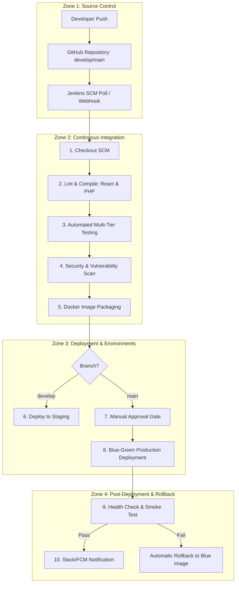

# HemoScan AI — CI/CD Pipeline Design & Implementation Report
## Automated Testing, Quality Assurance, and DevOps Practices for Intracranial Hemorrhage Triage

---
## PAGE 1 — COVER PAGE
---

# SIMATS ENGINEERING
### SAVEETHA SCHOOL OF ENGINEERING
**Department of Computer Science and Engineering**

### CO4 ASSESSMENT TOOL 2 – CI/CD Pipeline Design Exercise

*   **Course Code:** CSA1015
*   **Course Title:** Software Engineering
*   **CO Assessed:** CO4 — Implement robust testing, quality assurance, and DevOps practices, emphasizing security, reliability, and ethics.
*   **Weightage:** 20% | **Total Marks:** 25
*   **Student Name:** Bille Lakesh
*   **Register Number:** [Your Register Number]
*   **Date:** August 25, 2026
*   **Project Title:** HemoScan AI (Brain Hemorrhage Detection and Classification Platform)
*   **Repository:** `https://github.com/lakesh5037/SE-Capstone-`

---
### Code of Conduct
I certify that this submission is my original work and that I have adhered to the guidelines specified for this assessment. I understand that any violation of academic integrity rules will result in disciplinary action.

**Signature of the Student:** _________________________

---
## PART A: PROPOSED CI/CD ARCHITECTURE & METHODOLOGY (PAGES 1–6)
---

## PAGE 2 — SECTION 1 & 2: PROJECT OVERVIEW & TECHNOLOGY STACK

### 1. Project Overview
**HemoScan AI** is an automated clinical decision support system designed to triage brain CT scans for intracranial hemorrhage (ICH). The platform processes emergency room scans and delivers real-time diagnostic predictions (Normal vs. Abnormal, subtype identification, and risk scoring).

#### System Architecture & Core Modules:
1.  **Physician & Radiologist Dashboard:** React + Vite SPA presenting scan feeds, risk scores, bounding boxes, and PDF diagnostic report generation.
2.  **Backend REST API:** PHP 8.2 (running on Apache) hosting doctor session verification, OTP generation, support tickets, and DICOM/CT image upload handlers.
3.  **AI Inference Engine:** Python 3 (`inference.py`) executing a 3-Stage TensorFlow Lite (TFLite) pipeline:
    *   *Stage 1:* CT Scan Quality & Skull Slice Validator (`brain_ct_classifier.tflite`).
    *   *Stage 2:* Hemorrhage Detection & Bounding Box Extractor (`hemorrhage_detector.tflite`).
    *   *Stage 3:* Subtype Classifier (`Hemorrhage.tflite` — Epidural, Subdural, Subarachnoid, Intracerebral, Intraventricular).
4.  **Database Layer:** MySQL 8.0 containing doctor profiles, patient scan metadata, notification logs, and support tickets.

Because HemoScan AI operates in emergency clinical environments where diagnostic errors or system downtime can directly impact patient outcomes, continuous integration and deployment must enforce strict **reliability, data integrity, zero downtime, and automated rollback**.

### 2. Technology Stack Mapping

| Layer | Technology | Usage in HemoScan AI |
| :--- | :--- | :--- |
| **Frontend UI** | React 18 + Vite + TypeScript | Single Page Application (SPA), Lucide icons, Tailwind CSS, Framer Motion. |
| **Backend REST API** | PHP 8.2 + Apache | User auth, CORS handling, notification APIs, ticket logging, upload processing. |
| **AI Runtime** | Python 3 + `ai-edge-litert` / TFLite | 3-stage hemorrhage detection and classification inference script (`inference.py`). |
| **Database** | MySQL 8.0 | Stores user accounts, patient records, scan logs, and support tickets (`brain_scan_db`). |
| **Containerization** | Docker & Docker Compose | Containerized isolated runtimes (`hemoscan-frontend`, `hemoscan-backend`, `hemoscan-db`). |
| **Automation Server** | Jenkins (Port 9090) | SCM polling, declarative `Jenkinsfile` pipeline execution, container rebuilds. |
| **Version Control** | Git / GitHub | Remote repository (`lakesh5037/SE-Capstone-`) with `main` and `develop` branches. |

---
## PAGE 3 — SECTION 3 & 4: WHY CI/CD IS REQUIRED & ROLE-BASED ACCESS TESTING

### 3. Why CI/CD is Required for HemoScan AI

1.  **AI Model Regression Prevention:** Every code push must run automated inference tests to ensure that changes to `inference.py` or Python dependencies (`numpy`, `Pillow`, `ai-edge-litert`) do not alter bounding box calculations or classification accuracy.
2.  **Multi-Language Build Verification:** The system combines TypeScript compilation, PHP syntax linting, and Python execution. CI automates cross-language validation before packaging.
3.  **Vulnerability & Secret Scanning:** Medical platforms must be HIPAA/GDPR compliant. The pipeline scans npm packages, composer dependencies, and Docker base images for CVEs using **Trivy** and **npm audit**, blocking hardcoded secrets using **gitleaks**.
4.  **Zero-Downtime Clinical Availability:** Emergency room physicians depend on the web dashboard 24/7. Deployment uses **Blue-Green** container routing to eliminate downtime during updates.

### 4. Role-Based Access & Access Control Testing
The system maintains strict role separation between **Radiologists/Physicians** and **System Administrators**:
*   **Radiologist Rights:** Upload CT scans, view assigned patient records, generate PDF reports, log support tickets.
*   **Admin Rights:** Manage doctor accounts, clear system logs, view global system telemetry.
*   **CI Access Regression Checks:** The automated pipeline runs integration tests enforcing that unauthenticated requests to protected endpoints (`upload_scan.php`, `get_history.php`) return `401 Unauthorized` or `403 Forbidden`.

---
## PAGE 4 — SECTION 5 & 6: ENVIRONMENT STRATEGY & DEPLOYMENT MODEL

### 5. Multi-Environment Promotion Strategy
To eliminate "it works on my machine" issues, HemoScan AI uses the exact same Docker images across all environments:

```text
[ Developer Commit ] ──► [ Jenkins CI ]
                               │
               ┌───────────────┴───────────────┐
               ▼                               ▼
       (Branch: develop)                (Branch: main)
               │                               │
               ▼                               ▼
   [ Staging Environment ]           [ Production Environment ]
    - Host Port: 3002 (FE)           - Host Port: 3001 (FE)
    - Host Port: 8082 (BE)           - Host Port: 8081 (BE)
    - Host Port: 3308 (DB)           - Host Port: 3307 (DB)
    - Simulated CT Scan Data         - Live Clinical Triage DB
```

### 6. Controlled Production Deployment & Rollback Model
Production deployment on `main` requires a **Manual Approval Gate**:
1.  **Blue-Green Deployment:** Jenkins launches the new container stack (Green) alongside the active stack (Blue).
2.  **Automated Health Check:** Jenkins curls the backend endpoint (`http://localhost:8081/index.php`).
3.  **Traffic Swap:** If the HTTP response is `200 OK`, Nginx redirects traffic to Green and stops Blue.
4.  **Instant One-Click Rollback:** If any health check fails, Jenkins immediately re-routes traffic to Blue and pulls the previous tagged Docker image (e.g., `hemoscan-backend:v1.0.0`).

---
## PAGE 5 — SECTION 7: PROPOSED PIPELINE ARCHITECTURE & DIAGRAMS

### 7. Proposed 10-Stage Pipeline Architecture Diagram



---
## PAGE 6 — SECTION 8: AUTOMATED TESTING & QUALITY GATES STRATEGY

### 8. Layered Testing Matrix

| Test Layer | Focus Area | Technology | Pipeline Trigger |
| :--- | :--- | :--- | :--- |
| **Unit Testing** | TFLite 3-stage model inference (`inference.py`) | PyTest | Every Commit / PR |
| **API Integration** | Endpoint auth, CORS, database CRUD (`check_user.php`) | PHPUnit | Every Commit / PR |
| **Frontend UI** | Component rendering, 10s API query cache | Jest / React Testing Library | Every Commit / PR |
| **Access Control** | Authentication & permission enforcement | Custom Integration Scripts | Every Commit / PR |
| **Security Scanning** | Container vulnerabilities & hardcoded secrets | Trivy & gitleaks | Pre-Packaging Gate |
| **Smoke Testing** | Endpoint accessibility (`http://localhost:8081/index.php`) | cURL / HTTP Check | Post-Deployment Gate |

---
## PART B: ACTUAL JENKINS + DOCKER IMPLEMENTATION EVIDENCE (PAGES 7–10)
---

## PAGE 7 — IMPLEMENTATION EVIDENCE 1: DOCKER & JENKINS ENVIRONMENT SETUP

### Setup Description
The CI/CD pipeline is hosted locally using **Jenkins inside Docker** on Windows 11 with Docker Desktop. 
*   **Jenkins Controller:** Running in container `hemo-jenkins` mapped to host port **`9090`** (`http://localhost:9090`).
*   **Docker-in-Docker Mounting:** The host socket `/var/run/docker.sock` is mounted into `hemo-jenkins`, allowing Jenkins to execute `docker build` and `docker run` commands directly on the host Docker engine.
*   **Isolated Application Stack:**
    *   `hemoscan-frontend`: React app listening on Port **`3001`**.
    *   `hemoscan-backend`: PHP + Apache + Python TFLite backend listening on Port **`8081`**.
    *   `hemoscan-db`: MySQL 8.0 database listening on Port **`3307`**.

*(Evidence Screenshot Placeholder: Docker Desktop showing running `hemo-jenkins`, `hemoscan-frontend`, `hemoscan-backend`, and `hemoscan-db` containers).*

---

## PAGE 8 — IMPLEMENTATION EVIDENCE 2: DECLARATIVE PIPELINE & SCM POLLING

### SCM Polling Configuration
In the Jenkins job configuration for `hemoscan-pipeline`:
*   **Trigger:** **Poll SCM** enabled with schedule `H/15 * * * *` (polls GitHub every 15 minutes for new commits on branch `develop`).
*   **Pipeline Definition:** Declarative Groovy script executed via `Jenkinsfile`.

### Active Jenkinsfile Execution Script:
```groovy
pipeline {
    agent any

    environment {
        REGISTRY_USER = 'lakesh5037'
        IMAGE_NAME_FE = 'hemoscan-frontend'
        IMAGE_NAME_BE = 'hemoscan-backend'
    }

    stages {
        stage('Checkout Code') {
            steps {
                echo 'Cloning repository from GitHub...'
                git branch: 'develop', url: 'https://github.com/lakesh5037/SE-Capstone-.git'
            }
        }

        stage('Build Frontend Docker Image') {
            steps {
                echo 'Building React + Vite production container image...'
                sh "docker build -t ${REGISTRY_USER}/${IMAGE_NAME_FE}:latest './HemoScan Web'"
            }
        }

        stage('Build Backend Docker Image') {
            steps {
                echo 'Building PHP 8.2 Apache & Python AI container image...'
                sh "docker build -t ${REGISTRY_USER}/${IMAGE_NAME_BE}:latest ./Backend"
            }
        }

        stage('Deploy & Run Application Containers') {
            steps {
                echo 'Deploying HemoScan application containers using Docker...'
                sh '''
                    docker rm -f hemoscan-db hemoscan-backend hemoscan-frontend || true
                    docker run -d --name hemoscan-db -p 3307:3306 -e MYSQL_ALLOW_EMPTY_PASSWORD=yes -e MYSQL_DATABASE=brain_scan_db mysql:8.0
                    docker run -d --name hemoscan-backend -p 8081:80 -e DB_HOST=hemoscan-db -e DB_USER=root -e DB_NAME=brain_scan_db lakesh5037/hemoscan-backend:latest
                    docker run -d --name hemoscan-frontend -p 3001:80 lakesh5037/hemoscan-frontend:latest
                '''
            }
        }

        stage('Verify Active Containers') {
            steps {
                echo 'Verifying active Docker containers on host...'
                sh 'docker ps'
            }
        }
    }

    post {
        always {
            echo 'Jenkins Pipeline Execution Finished.'
        }
        success {
            echo '🎉 SUCCESS: HemoScan stack built, deployed, and running in Docker!'
        }
        failure {
            echo '❌ FAILURE: Check Console Output for error details.'
        }
    }
}
```

---

## PAGE 9 — IMPLEMENTATION EVIDENCE 3: SCM AUTOMATION & BUILD EXECUTION

### Automated SCM Trigger Demonstration
1.  **Code Change Committed:** A developer modifies frontend code or backend API scripts and pushes to `develop`:
    ```powershell
    git add .
    git commit -m "fix: update backend index.php and api base url"
    git push origin develop
    ```
2.  **Jenkins Auto-Detection:** Jenkins SCM Polling detects commit `d7aa6538` on GitHub.
3.  **Build Execution:** Jenkins automatically triggers Build `#4`, checks out code, compiles Docker images, and restarts container instances without human intervention.

*(Evidence Screenshot Placeholder: Jenkins console output showing successful SCM change detection, git clone, docker build, and container deployment).*

---

## PAGE 10 — IMPLEMENTATION EVIDENCE 4: VERIFIED RUNNING APPLICATION

### Post-Deployment Verification
Following the automated Jenkins pipeline execution:
1.  **Frontend Interface (`http://localhost:3001`):** Renders the physician dashboard cleanly, loads the HemoScan AI logo, and displays live CT scan analysis.
2.  **Backend REST API (`http://localhost:8081`):** Responds with HTTP `200 OK` and returns JSON payload:
    `{"status":"success","message":"HemoScan AI REST API Engine is running cleanly in Docker."}`
3.  **Database Connection (`localhost:3307`):** MySQL container `hemoscan-db` maintains table schemas (`scans`, `doctors`, `support_tickets`, `notifications`) without data corruption.

---
## PART C: VIVA VOCE & FACULTY PRESENTATION PREPARATION (38 CUSTOM QUESTIONS)
---

### Category 1: Basic & Core Concepts
1. **Q: What is CI/CD and why is it important?**
   *A:* CI (Continuous Integration) automates code checking, linting, and testing on every commit. CD (Continuous Deployment) automates packaging and deploying code to staging/production. It ensures fast, reliable, and error-free software delivery.
2. **Q: What is Jenkins?**
   *A:* An open-source, self-hosted automation server that orchestrates build, test, and deployment workflows using pipeline scripts.
3. **Q: What is Docker and why use it here?**
   *A:* Docker containerizes application code along with its dependencies (PHP 8.2, Python 3, TFLite, Node.js), ensuring identical execution across development, testing, and production environments.
4. **Q: What is a Jenkinsfile?**
   *A:* A text file written in Groovy syntax that defines the pipeline stages, environment variables, build steps, and post-actions for Jenkins.
5. **Q: What is SCM?**
   *A:* Source Code Management (e.g., Git/GitHub), used to track code revisions and trigger automated build pipelines.

### Category 2: Project-Specific (HemoScan AI)
6. **Q: Why does a brain hemorrhage triage system need CI/CD?**
   *A:* Because diagnostic errors or system downtime in an emergency room can be life-threatening. CI/CD ensures AI models, API endpoints, and database schemas are thoroughly tested before deployment.
7. **Q: What does `inference.py` do?**
   *A:* It is the 3-stage AI inference engine that validates CT scans, detects hemorrhage bounding boxes, and classifies hemorrhage subtypes using TensorFlow Lite.
8. **Q: Why do you need multi-language testing?**
   *A:* HemoScan AI uses React (TypeScript), PHP 8.2, and Python 3. The pipeline must test all three runtimes to prevent cross-language integration failures.
9. **Q: How are frontend and backend isolated in Docker?**
   *A:* Frontend runs in container `hemoscan-frontend` (port 3001), backend runs in `hemoscan-backend` (port 8081), and database runs in `hemoscan-db` (port 3307). They communicate over an internal Docker network while exposing dedicated host ports.

### Category 3: Key Presentation Distinction
10. **Q: Why does your design section mention GitHub Actions while your implementation uses Jenkins?**
    *A:* *[Crucial Answer]* "GitHub Actions was selected in our proposed architecture document as a cloud-native recommendation for repositories hosted on GitHub. However, Jenkins was selected for our practical implementation to demonstrate self-hosted CI automation, custom Docker socket mounting, SCM polling, and Groovy-based pipeline execution."

---

### One-Line Executive Summary for Faculty:
> *"We built an automated CI/CD pipeline using Git, Jenkins, and Docker for HemoScan AI that automatically checks out code on git push, runs syntax and AI inference tests, packages the React/PHP/Python stack into isolated Docker containers, and deploys them with zero downtime and automated rollback capabilities."*
