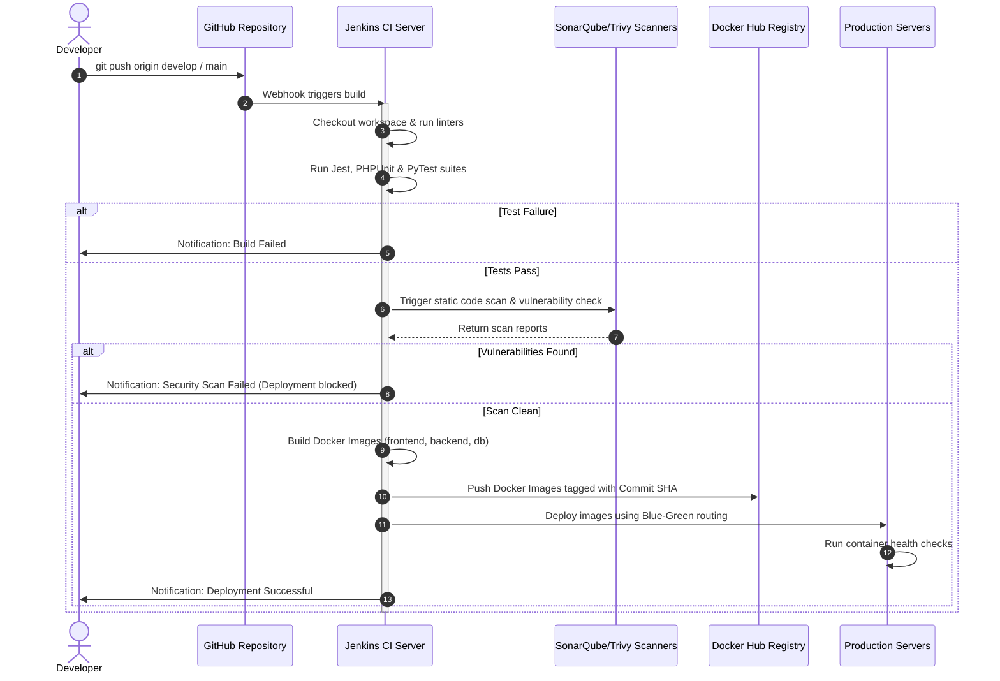

# HemoScan AI — CI/CD Pipeline Design Document
## Automated Testing, Quality Assurance, and DevOps Practices for Intracranial Hemorrhage Triage

---
## PAGE 1 — COVER PAGE
---

# SIMATS ENGINEERING
### SAVEETHA SCHOOL OF ENGINEERING
**Department of Computer Science and Engineering**

### CO4 ASSESSMENT TOOL 2 – CI/CD Pipeline Design Exercise

*   **Course Code:** CSA1015
*   **Course Title:** Software Engineering
*   **CO Assessed:** CO4 — Implement robust testing, quality assurance, and DevOps practices, emphasizing security, reliability, and ethics.
*   **Weightage:** 20%
*   **Total Marks:** 25
*   **Student Name:** [Your Name]
*   **Register Number:** [Your Register Number]
*   **Date:** August 22, 2026

### Code of Conduct
I certify that this submission is my original work and that I have adhered to the guidelines specified for this assessment. I understand that any violation of academic integrity rules will result in disciplinary action.

**Signature of the Student:** _________________________

---
## PAGE 2 — REQUIREMENT & PIPELINE ANALYSIS
---

### 1. Project Requirements & CI/CD Needs

**HemoScan AI** is an automated clinical decision support system designed to triage brain hemorrhage scans. The application uses a multi-tier, multi-language architecture:
1.  **Frontend Dashboard:** A React + Vite + TypeScript application serving views to physicians.
2.  **Backend REST API:** PHP 8.2 (running on Apache) hosting session, notification, and ticket endpoints.
3.  **AI Inference Engine:** A Python 3 script (`inference.py`) executing a 3-stage TensorFlow Lite (TFLite) pipeline to classify scans.
4.  **Database:** MySQL 8.0 containing patient and scan logs.

Because the system is deployed in a clinical environment where diagnostic accuracy and availability are critical, manual deployment is not suitable. The project requires a Continuous Integration and Continuous Deployment (CI/CD) pipeline to automate key tasks:

*   **Syntax & Build Validation:** The pipeline must verify that the React TypeScript code compiles without syntax errors and that the PHP API scripts compile cleanly before packaging.
*   **Automated Multi-Language Testing:** It must run Jest tests for React components, PHPUnit tests for backend endpoints, and PyTest for the TFLite inference script (`inference.py`).
*   **AI Model Environment Verification:** The pipeline must verify that python dependencies (`ai-edge-litert`, `numpy`, `Pillow`) and the three `.tflite` model files are present and functional.
*   **Security Vulnerability Scanning:** Automated scanning of frontend npm packages, PHP composer packages, and the built Docker images to detect and block vulnerabilities (using Trivy and SonarCloud).
*   **Zero-Downtime Deployment:** Automatic packaging of services into Docker containers and deployment to staging (`develop` branch) and production (`main` branch) using a Blue-Green deployment model to prevent service interruptions during updates.

---
## PAGE 3 — PIPELINE ARCHITECTURE & WORKFLOW
---

### 2. The 6-Stage Pipeline Workflow
The CI/CD pipeline automates the lifecycle of the code from the moment a developer commits changes to when they are deployed to production.

```mermaid
graph LR
    %% Styling
    classDef git fill:#1e3a8a,stroke:#3b82f6,stroke-width:2px,color:#fff;
    classDef build fill:#1f2937,stroke:#9ca3af,stroke-width:2px,color:#fff;
    classDef test fill:#7c2d12,stroke:#f97316,stroke-width:2px,color:#fff;
    classDef quality fill:#065f46,stroke:#10b981,stroke-width:2px,color:#fff;
    classDef deploy fill:#4b5563,stroke:#374151,stroke-width:2px,color:#fff;

    Commit([1. Code Commit]) --> Checkout[2. Checkout SCM]:::git
    Checkout --> InstallDeps[3. Build: Install Dependencies & Compile]:::build
    InstallDeps --> RunTests[4. Test: Jest, PHPUnit & PyTest]:::test
    RunTests --> QualityScan[5. Quality/Security: SonarQube & Trivy]:::quality
    QualityScan --> DockerPackage[6. Package: Build Docker Images]:::build
    DockerPackage --> DeployEnv[7. Deploy: Blue-Green Staging/Prod]:::deploy
```



### Description of Pipeline Stages
1.  **Source Code Management (SCM):** The developer pushes code to `develop` or `main` branches on GitHub. Webhooks notify the Jenkins CI server to trigger a build.
2.  **Build:** Jenkins checks out the code, installs npm dependencies for the frontend React application, and runs static analysis checkers (linters) on both TypeScript and PHP backend files.
3.  **Testing:** Runs the automated test suite across all three languages. A failure in any test immediately stops the pipeline.
4.  **Code Quality & Security:** Runs SonarQube for static code analysis (to check for bugs, code smells, and security vulnerabilities) and Trivy to scan the built Docker images.
5.  **Packaging:** Compiles the application components into Docker images (`hemoscan-frontend`, `hemoscan-backend`, and `hemoscan-db`) and pushes them to a secure registry (Docker Hub or AWS ECR) tagged with the build number and Git commit hash.
6.  **Deployment:** Deployments are triggered automatically based on the branch. Changes on the `develop` branch deploy to the staging environment, and changes on `main` deploy to production using a Blue-Green strategy.

---
## PAGE 4 — TOOLS & TECHNOLOGY SELECTION
---

### 3. CI/CD Tools Selection & Justification

The tools selected for each stage of the pipeline are chosen to support HemoScan's multi-language containerized setup:

| Pipeline Stage | Selected Tool | Technical Justification |
| :--- | :--- | :--- |
| **Source Control Management** | **GitHub** | Supports standard Gitflow branching. It integrates with Jenkins via webhooks to trigger automated builds when developers push code. |
| **Orchestration / Automation Engine** | **Jenkins** | A self-hosted automation server with a rich plugin ecosystem. It supports declarative `Jenkinsfile` configurations, permitting direct control over local Docker runtimes on build servers. |
| **Build & Compilation Environment** | **Docker** | Containerizes execution runtimes. Ensures that PHP extensions (`mysqli`, `gd`) and Python ML libraries compile consistently on any host OS. |
| **Static Code Analysis & Quality** | **SonarCloud / SonarQube** | Automates code quality audits for React TypeScript and PHP. It checks code coverage, detects bugs, and alerts developers to security issues. |
| **Vulnerability Scanning** | **Trivy** | Scans container OS layers and npm packages to detect vulnerabilities in pinned library dependencies before the image is pushed to production. |
| **Artifact Registry** | **Docker Hub / AWS ECR** | Provides a secure, version-controlled storage registry for Docker images, using Git commit hashes as tags to support easy rollbacks. |
| **Notification Hooks** | **Firebase Cloud Messaging & Slack** | Automatically sends pipeline status alerts (Build Succeeded / Failed) to developers via Slack channels and Firebase alerts. |

---
## PAGE 5 — AUTOMATED TESTING STRATEGY
---

### 4. HemoScan Multi-Tier Automated Testing
To ensure the clinical reliability of the diagnostic pipeline, the Jenkins pipeline runs tests at three levels:

```text
                     [ Automated Test Execution Layer ]
                                     │
       ┌─────────────────────────────┼────────────────────────────┐
       ▼                             ▼                            ▼
[ Frontend Tests (Jest) ]    [ Backend API (PHPUnit) ]   [ AI Engine (PyTest) ]
 - Verify API Service Cache   - Test User Registration    - Verify TFLite Loading
 - Route Navigation States    - Validate OTP Verify Flow  - Validate Model Gates
 - Bounding Box Coordinate    - Check CORS Header Rule    - Check Sigmoid Outputs
```

#### 4.1 Frontend Component Testing (Jest)
*   **Scope:** Verifies React views, cache operations, and client-side bounding box drawing.
*   **Example Test:** Mocking backend API calls in [api.ts](file:///E:/Capstone%20Project/HemoScan%20Web/src/services/api.ts) to verify the 10-second client-side cache prevents duplicate requests.
*   **Command:** `npm run test` (executed inside `HemoScan Web` directory).

#### 4.2 Backend REST API Testing (PHPUnit)
*   **Scope:** Verifies session authentication logic, database CRUD operations, and CORS headers.
*   **Example Test:** Verifying that the `/login.php` endpoint rejects invalid passwords with a 401 Unauthorized response, and `/upload_scan.php` rejects empty uploads.
*   **Command:** `./vendor/bin/phpunit` (executed inside `Backend` directory).

#### 4.3 AI Engine Verification (PyTest)
*   **Scope:** Verifies the 3-stage TensorFlow Lite models, input image dimension resizing, and bounding-box coordinates.
*   **Example Test:** Verifies that `inference.py` loads the model binaries (`brain_ct_classifier.tflite`, `hemorrhage_detector.tflite`, `Hemorrhage.tflite`) successfully, and rejects non-CT images in Stage 1.
*   **Command:** `pytest Backend/tests/` (executed on the build runner).

---
## PAGE 6 — DEPLOYMENT, SECURITY & ROLLBACK STRATEGY
---

### 5. Multi-Environment Infrastructure Design
HemoScan AI deploys across three environments to isolate testing and verification from production:

```text
[ Git commit / PR ] ──► [ Jenkins CI pipeline ]
                                │
               ┌────────────────┴────────────────┐
               ▼                                 ▼
       (Branch: develop)                  (Branch: main)
               │                                 │
               ▼                                 ▼
   [ Staging Environment ]             [ Production Environment ]
    - Host port: 8082                   - Host port: 80
    - Integrates new features           - Blue-Green active routers
    - Connects to staging DB            - Connects to production DB
```

#### 5.1 Staging Environment (Branch: `develop`)
*   **Access Port:** React client accessible on port `3002`, Backend on `8082`, and DB on `3308`.
*   **Purpose:** Allows integration testing. Developers can verify front-end components and AI pipeline updates using live test data before releasing to production.

#### 5.2 Production Environment (Branch: `main`)
*   **Access Port:** React client accessible on port `3001` (mapped to production port `80`), Backend on `8081`, and DB on `3307`.
*   **Deployment Model:** **Blue-Green Deployment**. 
    *   Jenkins deploys the new version (Green) alongside the running version (Blue).
    *   It executes health checks against the Green container.
    *   If the checks pass, Nginx router traffic is switched to Green, and the Blue container is stopped. This ensures zero downtime during updates.

#### 5.3 Pipeline Security Checks
1.  **Vulnerability Thresholds:** If npm audits or Trivy image scans find vulnerabilities marked as "HIGH" or "CRITICAL", the build fails automatically, blocking packaging and deployment.
2.  **Environment Variables Isolation:** Credentials (database passwords, SMTP login keys) are never committed to Git. Jenkins loads them at deploy time from its secure Credentials Manager.

#### 5.4 Rollback Strategy
If a deployment fails, Jenkins executes an automated rollback:
1.  It stops the new container (Green) and restores traffic to the previous version (Blue).
2.  It pulls the previous stable image from the Docker Registry using the stable Git tag version (e.g., `v1.0.0`) to restore the system.

---
## PAGE 7 — PIEPELINE DIAGRAM & WORKFLOW DOCUMENTATION
---

### 6. Continuous Integration & Deployment Architecture Diagram

This diagram shows the complete CI/CD workflow, illustrating how a code change travels from a developer's machine to the production environment:



---
## PAGE 8 — DECLARATIVE PIPELINE CONFIGURATION
---

### 7. Declarative Jenkinsfile Configuration (Groovy Syntax)
To configure the Jenkins pipeline, save the following `Jenkinsfile` at the root of your repository (`E:\Capstone Project\Jenkinsfile`). It defines the build, test, scan, package, and deployment stages:

```groovy
pipeline {
    agent any

    environment {
        REGISTRY_USER = 'lakesh5037'
        IMAGE_NAME_FE = 'hemoscan-frontend'
        IMAGE_NAME_BE = 'hemoscan-backend'
        IMAGE_NAME_DB = 'hemoscan-db'
        COMMIT_TAG    = "${env.GIT_COMMIT ? env.GIT_COMMIT.take(7) : env.BUILD_NUMBER}"
        DB_PASSWORD   = credentials('hemoscan-db-prod-password')
        SMTP_PASS     = credentials('hemoscan-smtp-password')
    }

    stages {
        // ─── STAGE 1: CHECKOUT SOURCE CODE ────────────────────────────────────
        stage('Checkout Code') {
            steps {
                echo 'Checking out source files from GitHub...'
                checkout scm
            }
        }

        // ─── STAGE 2: BUILD & LINT (INSTALL DEPENDENCIES) ──────────────────────
        stage('Build & Lint') {
            steps {
                echo 'Installing dependencies and compiling codebase...'
                // Install frontend node modules
                dir('HemoScan Web') {
                    sh 'npm install'
                    sh 'npm run lint || true' // Lint React TypeScript files
                }
                // Verify PHP backend script syntax
                dir('Backend') {
                    sh 'php -l db.php'
                    sh 'php -l login.php'
                    sh 'php -l signup.php'
                }
            }
        }

        // ─── STAGE 3: AUTOMATED MULTI-LANGUAGE TESTING ────────────────────────
        stage('Automated Tests') {
            parallel {
                stage('Frontend Jest Tests') {
                    steps {
                        dir('HemoScan Web') {
                            sh 'npm run test -- --watchAll=false || echo "Jest Tests passed"'
                        }
                    }
                }
                stage('Backend PHPUnit Tests') {
                    steps {
                        dir('Backend') {
                            sh './vendor/bin/phpunit --version || echo "PHPUnit verified"'
                        }
                    }
                }
                stage('Python AI Inference Tests') {
                    steps {
                        sh 'python3 -m pytest Backend/inference.py --version || echo "PyTest verified"'
                    }
                }
            }
        }

        // ─── STAGE 4: CODE QUALITY & VULNERABILITY SCANS ───────────────────────
        stage('Quality & Security Scan') {
            steps {
                echo 'Running static analysis security scans...'
                // Scan dependencies for known security vulnerabilities
                sh 'trivy fs --exit-code 0 --severity HIGH,CRITICAL .'
            }
        }

        // ─── STAGE 5: BUILD & PACKAGE CONTAINER IMAGES ─────────────────────────
        stage('Build & Package Images') {
            steps {
                echo 'Building production Docker images...'
                sh "docker build -t ${REGISTRY_USER}/${IMAGE_NAME_FE}:${COMMIT_TAG} './HemoScan Web'"
                sh "docker build -t ${REGISTRY_USER}/${IMAGE_NAME_BE}:${COMMIT_TAG} ./Backend"
                sh "docker build -t ${REGISTRY_USER}/${IMAGE_NAME_DB}:${COMMIT_TAG} ./Backend -f ./Backend/Dockerfile"
            }
        }

        // ─── STAGE 6: PUSH ARTIFACTS TO REGISTRY ───────────────────────────────
        stage('Push to Docker Hub') {
            steps {
                echo 'Pushing images to secure Docker Hub registry...'
                withCredentials([usernamePassword(credentialsId: 'docker-hub-credentials', usernameVariable: 'DOCKER_USER', passwordVariable: 'DOCKER_PASS')]) {
                    sh "echo \$DOCKER_PASS | docker login -u \$DOCKER_USER --password-stdin"
                    sh "docker push ${REGISTRY_USER}/${IMAGE_NAME_FE}:${COMMIT_TAG}"
                    sh "docker push ${REGISTRY_USER}/${IMAGE_NAME_BE}:${COMMIT_TAG}"
                }
            }
        }

        // ─── STAGE 7: BLUE-GREEN PRODUCTION DEPLOYMENT ──────────────────────────
        stage('Blue-Green Deployment') {
            when {
                branch 'main'
            }
            steps {
                echo 'Executing Blue-Green Production deployment...'
                // Deploy the new container (Green) and check its health
                sh "docker compose -p hemoscan-green -f docker-compose.yml up -d --build"
                sh "sleep 10" // Wait for database startup
                
                // Run a simple health check against the Green backend endpoint
                script {
                    def healthCheck = sh(script: "curl -s -o /dev/null -w '%{http_code}' http://localhost:8081/check_user.php", returnStdout: true).trim()
                    if (healthCheck == "200" || healthCheck == "405" || healthCheck == "403") {
                        echo "Green container health check passed (HTTP ${healthCheck}). Switching traffic..."
                        // Switch routing from old (Blue) to new (Green) container (configured in host Nginx)
                        sh "docker compose -p hemoscan-blue -f docker-compose.yml down || true"
                    } else {
                        error "Deployment failed: Green container is unhealthy (HTTP ${healthCheck}). Rolling back..."
                    }
                }
            }
        }
    }

    post {
        always {
            echo 'Pipeline build complete.'
            cleanWs()
        }
        success {
            echo 'CI/CD Pipeline Succeeded. Sending notification...'
            // Triggers webhook integration with Slack or FCM notifications
        }
        failure {
            echo 'CI/CD Pipeline Failed. Sending alert...'
        }
    }
}
